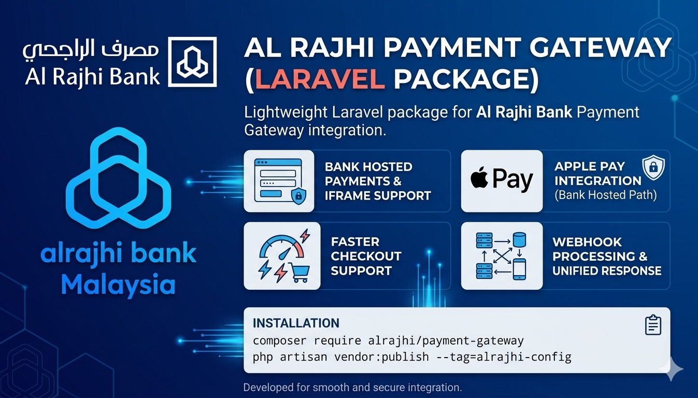
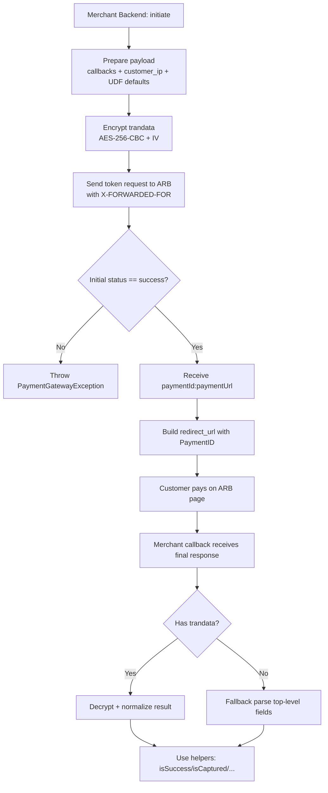
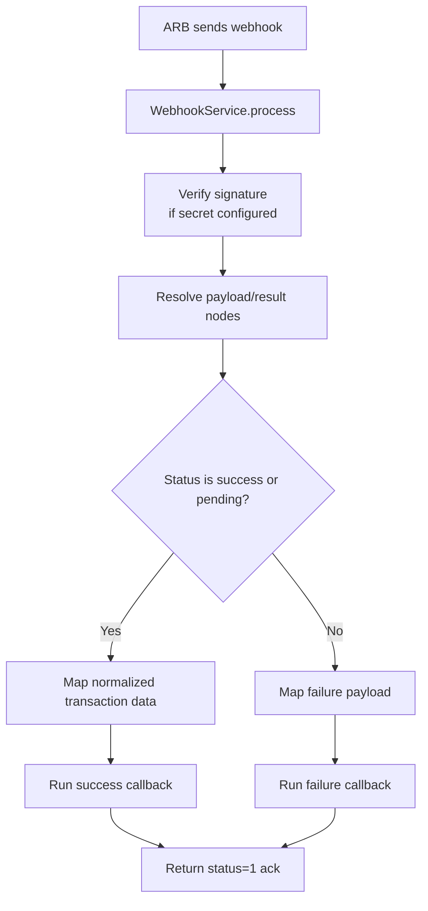

# AlRajhi Payment Gateway (Laravel Package)

Lightweight Laravel package for Al Rajhi Bank Payment Gateway integration.

## What this package provides

- Bank Hosted payment initiation
- Faster Checkout support
- Iframe support
- Apple Pay (Bank Hosted path)
- Webhook processing service
- BIN check helper
- Unified response normalization and exception shape
- UDF1..UDF10 forwarding + validation
- Clean internal architecture (orchestrators + dedicated services)

## Installation

```bash
composer require alrajhi/payment-gateway
php artisan vendor:publish --tag=alrajhi-config
```

## Configuration

Set these values in your `.env`:

```env
ALRAJHI_BASE_URL=https://securepayments.alrajhibank.com.sa
ALRAJHI_ENVIRONMENT=sandbox
ALRAJHI_TRANPORTAL_ID=your_tranportal_id
ALRAJHI_TRANPORTAL_PASSWORD=your_password
ALRAJHI_RESOURCE_KEY=your_resource_key

# Compatibility toggles for trandata encryption/decryption
ALRAJHI_URL_ENCODE_BEFORE_ENCRYPT=false
ALRAJHI_URL_DECODE_AFTER_DECRYPT=false
ALRAJHI_RETRY_RAW_TRANDATA_ON_INVALID=true

ALRAJHI_RESPONSE_URL=${APP_URL}/api/payment/success
ALRAJHI_ERROR_URL=${APP_URL}/api/payment/failed
ALRAJHI_WEBHOOK_SECRET=your_webhook_secret

ALRAJHI_STRICT_RESPONSE_MODE=false
ALRAJHI_ACCEPT_QUERY_RESPONSE=true
ALRAJHI_ACCEPT_DIRECT_CALLBACK_FIELDS=true
ALRAJHI_SUCCESS_STATUSES=1,success,approved,captured,processing,voided

ALRAJHI_PREFER_CATALOG_MESSAGE=true
ALRAJHI_INCLUDE_OFFICIAL_MESSAGE=true

ALRAJHI_UDF_AUTO_FILL_DEFAULTS=false
ALRAJHI_CAPTURE_AUTO_SET_UDF7_R=true
```

## Quick start

```php
use AlRajhi\PaymentGateway\Facades\AlRajhiPayment;

Route::post('/test-payment', function (Request $request) {
    $trackId = 'TRK-' . now()->format('YmdHis') . '-' . random_int(1000, 9999);

    try {
        $payment = AlRajhiPayment::bankHosted()->initiate([
            'id' => env('ALRAJHI_TRANPORTAL_ID'),
            'password' => env('ALRAJHI_TRANPORTAL_PASSWORD'),
            'amount' => '400.00',
            'action' => '1',
            'currencyCode' => '682',
            'trackId' => $trackId,
            'responseURL' => env('ALRAJHI_RESPONSE_URL'),
            'errorURL' => env('ALRAJHI_ERROR_URL'),
            'response_url' => env('ALRAJHI_RESPONSE_URL'),
            'error_url' => env('ALRAJHI_ERROR_URL'),
            'customerIp' => $request->ip(),
        ]);

        return response()->json([
            'success' => true,
            'payment' => $payment,
        ]);
    } catch (\Throwable $e) {
        return response()->json([
            'success' => false,
            'error' => $e->getMessage(),
            'exception' => get_class($e),
        ], 500);
    }
});
```

Test Success response shape:

```php
[
         "success": true,
        "payment_id": "60000260000768000",
        "payment_url": "https://securepayments.alrajhibank.com.sa/pg/paymentpage.htm",
        "redirect_url": "https://securepayments.alrajhibank.com.sa/pg/paymentpage.htm?PaymentID=60000260000768",
        "track_id": "TRK-20260402093943-8348"
]
```
Live Success response shape:

```php
[
        "success": true,
        "payment_id": "700202609733477641",
        "payment_url": "https://digitalpayments.neoleap.com.sa/pg/paymentpage.htm",
        "redirect_url": "https://digitalpayments.neoleap.com.sa/pg/paymentpage.htm?PaymentID=700202609733477641",
        "track_id": "TRK-20260407130233-4761"
]
```

## Flow Charts

### 1) Payment flow (Bank Hosted)



### 2) Webhook flow



## Response handling behavior

- First priority is `trandata` (decrypt and parse it).
- If `trandata` is missing, fallback to top-level fields (`ErrorText`, `Error`, etc.).
- Accepts JSON arrays/objects and query-string-like payloads.
- Key names are normalized (`paymentId/paymentid`, `errorText/errortext`, `trackId/trackid`).

## UDF policy

- Supports `udf1` to `udf10` in request and normalized response.
- Each UDF must be scalar and max length 255.
- Auto defaults for missing `udf1..udf5` (when enabled):
  - `udf1 = order:{order_id|track_id}`
  - `udf2 = customer:{customer_id}`
  - `udf3 = channel:{channel}` (default `web`)
  - `udf4 = source:{source}` (default `bank_hosted`, `iframe` for iframe flow)
  - `udf5 = ref:{reference_type}` (default `TrackID`)
- Capture compliance:
  - For `action=5`, auto-set `udf7=R` (non-saved-card capture) when missing and enabled.
  - For `action=5`, `udf10` (if provided) must be `PARTIALCAPTURE` or `FINALCAPTURE`.

## Callback vs Webhook (recommended pattern)

- Always use webhook as the **single source of truth** for order/payment updates.
- Use `paymentCallback` for UX only (redirect page/message), not for final state changes.

## Handling callback result (UX only)

```php
// webhook endpoint for testing callback handling
Route::post('/payment/success', function (Request $request) {
    $result = AlRajhiPayment::bankHosted()->handleResponse($request->all());
    $GetResult = AlRajhiPayment::bankHosted()->handleResponseData($result);

    // منطق تحديد الحالة الموحدة
    $statusFinal = $GetResult['status_final'] ?? 'unknown';
    $bankStatus  = $GetResult['bank_status'] ?? null;

    $paymentStatus = match ($statusFinal) {
        'success'   => 'success',
        'failed'    => 'failed',
        'pending'   => 'pending',
        'voided'    => 'voided',
        'cancelled' => 'cancelled',
        default     => $bankStatus ?? 'unknown',
    };

    // Payment::update([...], ['status' => $paymentStatus]);
    // Order::update([...], ['status' => ...]);

    return response()->json(array_merge($GetResult, [
        'payment_status' => $paymentStatus,
    ]));

});
Route::post('/payment/failed', function (Request $request) {

    Log::info('Payment failed callback received', $request->all());
});


// Recommended in callback: return message/view only
// Do NOT finalize order/payment status here.
```

## Update order and payment records (Webhook-driven)

Use your own models, and update states only inside webhook handlers.

```php
#As Test I made it in the Route.php 
use AlRajhi\PaymentGateway\Facades\AlRajhiPayment;
Route::post('/webhook', function (Request $request) {
    $payload = $request->all();

    // تسجيل البيانات للمتابعة
    Log::info('AlRajhi Webhook received', $payload);

    // استخراج أهم الحقول
    $result    = $payload['result'][0] ?? [];
    $payLoad   = $payload['payLoad'][0] ?? [];
    $type      = $payload['type'] ?? null;
    $trackId   = $payLoad['trackId'] ?? null;
    $paymentId = $payLoad['paymentId'] ?? null;
    $status    = $result['status'] ?? ($result['error'] ?? null);

    // Payment::where('track_id', $trackId)->update([...]);
    // Order::where('payment_id', $paymentId)->update([...]);

    return response()->json([['status' => '1']]);
});
```

## Webhook endpoint (primary)

The package registers:

```text
POST /alrajhi/webhook
```

Implementation example is already provided in:

- `Update order and payment records (Webhook-driven)`

## Callback endpoint (secondary / UX only)

Use callback endpoint to show user-facing result page or redirect logic only.
Do not make final order/payment updates here.

## BIN check

```php
$binData = AlRajhiPayment::binCheck('515735');
```

## Troubleshooting IPAY0100013 (Invalid transaction data)

When the gateway returns `IPAY0100013`, validate these items exactly:

- Endpoint URL must be your assigned gateway host (many merchants currently use `https://securepayments.neoleap.com.sa`).
- Required transaction fields must be present with exact meaning:
  - `id` (tranportal id)
  - `password` (tranportal password)
  - `action=1`
  - `currencyCode=682`
  - `amt` with 2 decimals (example `12.00`)
  - `trackId` unique value
  - `responseURL` and `errorURL` valid public HTTPS URLs
- Resource key must match the same environment/credentials pair.
- If you changed `.env`, run:

```bash
php artisan optimize:clear
```

This package now retries once automatically without URL-encoding `trandata` when the gateway returns `IPAY0100013`.
